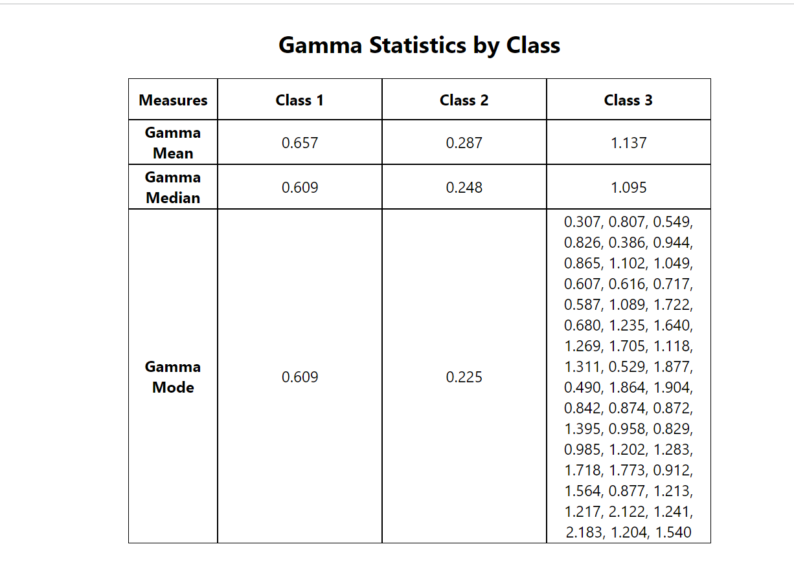

# Getting Started with Create React App

# Instructions to run the app
1.Clone the project from github repo.
2.`yarn install` the project.
3.After installing node_modules enter `yarn start`.

# In order to run the project Use `yarn start`
Open http://localhost:3000 to view the project.

# Screenshots for Flavanoids Table

# Screenshot for Gamma Table

# Screenshot for application

